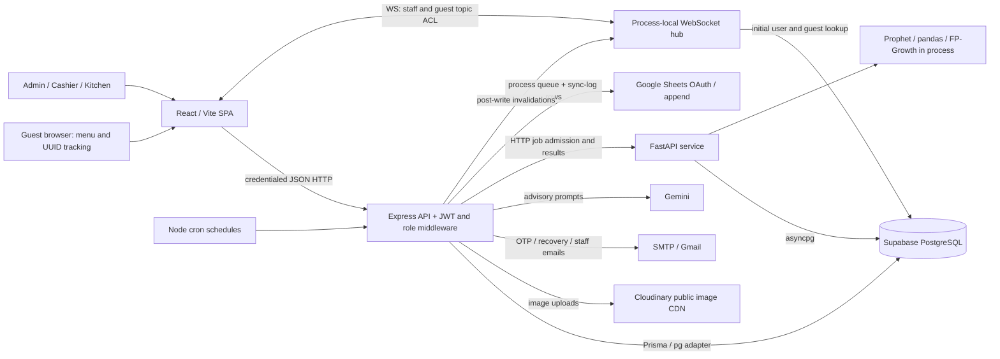

**SYSTEM AUDIT STATUS**

Inventory transaction remediation: [INVENTORY_TRANSACTION_FIXES.md](INVENTORY_TRANSACTION_FIXES.md).

**Historical baseline:** Authentication fixes were implemented on 2026-10-03.
See [authentication remediation](C:/Users/liamk/WebApp/AbbeysKitchenette/audit/AUTHENTICATION_FIXES.md)
for current status, test results and the required Supabase migration. Findings
below describe the original audited commit and are not a claim that fixed code
still has those defects.

Order permissions and state transitions were subsequently addressed in
[order remediation](C:/Users/liamk/WebApp/AbbeysKitchenette/audit/ORDER_STATE_FIXES.md).
That document records the scope, tests and remaining financial/inventory work.

Request replay, atomic acceptance and shift closure changes are recorded in
[financial remediation](C:/Users/liamk/WebApp/AbbeysKitchenette/audit/FINANCIAL_TRANSACTION_FIXES.md).

Audit completed for the available source, installed dependency trees, isolated executions and selected public browser workflows. **Production readiness is not established; release is blocked by C01 and unresolved financial/security risks.** This is not a certification that the entire deployed system was tested.

Audit date: 2026-10-02 (Asia/Manila). Repository: C:/Users/liamk/WebApp/AbbeysKitchenette. Branch: **code-revision**. Baseline commit: **530c4cf064f080ef304c8ba66814d9ecd1f7d8ec**. Critical: 1 · High: 15 · Medium: 24 · Low: 2. Severity ranks impact; evidence status separately states confidence.

## Executive summary

SmartCafe has a substantive implementation: role middleware, cookie-based authentication, server repricing, inventory version checks, financial transactions, health endpoints, query validation, batch consumption, stock history and useful schema indexes. These safeguards are uneven across alternate entry points and failure paths. The most serious reproduced problem is reset-token/session confusion. Further confirmed defects include an OTP challenge bypass, cross-order item updates, stale order transitions, unbounded validation, ML admission races, malformed-JSON status handling and browser failure/accessibility behavior.

No production database mutations, real payments, emails, uploads, model jobs or external spreadsheet writes were performed. No application fixes were made. Audit scripts, isolated tests and evidence are additions for review.

## Scope and evidence limits

- **Confirmed issue:** executed against actual function/middleware/browser logic with explicitly isolated dependencies, or an unequivocal source/schema inconsistency.
- **Likely issue:** a concrete unsafe interaction is traced but a full real-service failure/concurrency reproduction was not performed.
- **Potential issue:** a missing safeguard has contingent exposure/impact.
- **Recommendation / Not verified:** an improvement or missing operational evidence, not an invented incident.

Current environment files target external services. They were inspected for key names/configuration patterns without printing credential values. A disposable full-stack database environment was not available for live transaction tests. Browser observations use the actual built frontend with a loopback-only fixture API ([audit/preview.mjs](C:/Users/liamk/WebApp/AbbeysKitchenette/audit/preview.mjs)) and synthetic product/account inputs. They establish UI behavior under those responses, not successful integration with production. Boundary tests use the actual Express application and middleware but mock controllers/DB/storage.

**Not verified:** every authenticated screen/workflow; real PostgreSQL constraints, grants/RLS and existing data; query execution plans; production traffic/load; live email/storage/Gemini/Sheets failures; MFA mailbox delivery; deployed TLS/DNS/CDN/firewall/proxy policies; hosted metrics/alerts; backup restoration; rollout/rollback; complete Git-history secret scanning; screen-reader/contrast coverage across all pages.

## Architecture overview and system map



| Component | Implementation and communication | Failure/scaling concern |
|---|---|---|
| Frontend | React 19, React Router, TanStack Query, Zustand, Axios, Tailwind/shadcn | Eager bundle; invalidation/reconnect gaps; selected error/dialog defects |
| API | Express 5, 135 module registrations plus health/readiness; Zod; JWT cookies; admin/cashier/kitchen | Authentication token confusion; transition-specific ACL gaps; single-process limiter/hub |
| Database | PostgreSQL, Prisma 7/pg and ML asyncpg; order/receipt/shift/batch/recipe/deduction/analytics tables | Core dependency; live constraints/backup/pool capacity Not verified |
| Authentication | Password + admin email OTP; staff location checks; reset tokens; HttpOnly strict cookies | Alternate OTP path and reset/session mixing; no durable revocation |
| Images | Multer streams to Cloudinary; 5 MB products, 2 MB avatars | Provider/dependency failures; metadata-only prefilter; orphan cleanup Not verified |
| Email | Nodemailer SMTP or Gmail; development fallback | Login/recovery depend on delivery; real deadlines/delivery Not verified |
| Analytics | FastAPI, Prophet forecasts and FP-Growth; DB job/result records | No direct service auth; non-atomic admission; CPU/event-loop contention |
| AI | Gemini pricing/waste advisory calls | Untrusted output validation gaps; cost/timeout/provenance controls need validation |
| Jobs/queue | Node cron; Python asyncio tasks; Sheets process serialization and DB log | No shared durable execution broker or replica-safe leases |
| Cache/realtime | TanStack query cache; WS invalidations; OAuth token cache | No shared event broker/replay; offline clients miss state |
| Payments | Cash / GCash / Maya are manually recorded methods | No payment gateway/webhook found; gateway settlement/security is not applicable to current code |
| Deployment/monitoring | Local env examples, health/readiness, console/domain audit logging | CI/infrastructure/backup/recovery/hosted monitoring Not verified |

The critical sales path is SPA → authenticated order API → server-side price/discount computation → shift selection → guarded batch deductions + receipt/payment/order transaction → response → derived availability/audits/notifications/Sheets/realtime. Guest placement stores an unpaid pending order and UUID tracking handle; staff acceptance then enters the financial path. Important cancellation paths restore recorded batches, but partial restoration recalculates attribution from mutable recipes.

Single points of failure are the database, single API/WS/scheduler process and ML execution process. Email is a login/recovery dependency. ML is unnecessarily coupled to overall readiness; Sheets and advisory AI should remain degradable optional services. No Redis/shared cache, durable broker or multi-instance event fanout was observed. Their absence is not itself a bug for a single-instance café deployment, but scaling/availability assumptions must be explicit.

## Verification results

| Check | Result | Meaning/limit |
|---|---|---|
| Original server suite | PASS: 40 tests / 5 files | Mostly isolated utilities/middleware/report logic |
| Final combined server suite | PASS: 275 tests / 7 files | Includes unsafe-behavior characterizations; not a safety certificate |
| Added defect characterizations | PASS: 10 | Actual functions with DB/email/external services mocked |
| Added Express boundary suite | PASS: 225 | No-cookie routes, cashier/admin boundaries, kitchen acceptance, malformed JSON; controllers mocked |
| Added Python reproduction suite | PASS: 3 | Pool race, forecast admission race, 9 ML endpoints without auth dependencies |
| Frontend production build | PASS | Main chunk 1,636.52 kB / 445.00 kB gzip; chunk warning |
| Frontend lint | FAIL: 46 errors / 16 warnings | Existing static-check failures |
| npm advisory lookup | 15 server / 8 client affected package nodes | Reachability varies; see raw reports |
| Python pip check | PASS | Dependency compatibility only, not security |
| Python OSV query | 71 installed packages checked; 2 matched; pagination complete | pip and urllib3; aliases need deduplication |
| Browser fixtures | Selected public routes/forms/navigation and 390/768 px layouts checked | No authenticated workflow or actual external integration |
| PostgreSQL integration/load/backup restoration | **Not verified** | No live data writes performed |

See [audit/endpoint-matrix.md](C:/Users/liamk/WebApp/AbbeysKitchenette/audit/endpoint-matrix.md) for the **135-row endpoint inventory**, including method, source, declared auth/roles, validation and rate limits, and [audit/endpoint-inventory.json](C:/Users/liamk/WebApp/AbbeysKitchenette/audit/endpoint-inventory.json) for machine-readable routing evidence. Inventorying an endpoint is not verifying its business execution. See [audit/http-boundary-results.json](C:/Users/liamk/WebApp/AbbeysKitchenette/audit/http-boundary-results.json) for the executed route-boundary cases.

The isolated service test that permits a generic cancelled transition is **not an exposed HTTP cancellation bypass**: the HTTP status schema rejects cancelled. It is a latent hardening/test-design concern only and is not counted as a security finding.

## Detailed findings by priority

### Critical priority issues

#### C01: Password-reset tokens authenticate as staff sessions

**Severity:** Critical  
**Category:** Security  
**Evidence status:** Confirmed issue  
**Location:** [server/src/middleware/authenticate.middleware.js](C:/Users/liamk/WebApp/AbbeysKitchenette/server/src/middleware/authenticate.middleware.js:1); [server/src/modules/auth/auth.service.js](C:/Users/liamk/WebApp/AbbeysKitchenette/server/src/modules/auth/auth.service.js:129); [server/src/realtime/auth.js](C:/Users/liamk/WebApp/AbbeysKitchenette/server/src/realtime/auth.js:64)

**Finding:** REST verifies the JWT signature and uses sub without checking token purpose. Reset tokens use the same signing mechanism as session tokens. The WebSocket implementation rejects purpose-only tokens, making the two authentication boundaries inconsistent.

**Evidence:** The isolated test “HTTP auth accepts a password-reset JWT and authorizes admin actions” signs an audit reset token, places it in the token cookie, and passes both authenticate and authorize("admin"). It uses a mocked active admin and no real credentials. REST does not consult the reset-token table, so consuming a reset link does not revoke its REST use before JWT expiration.

**Impact:** Someone possessing a reset link can bypass the normal password and admin OTP login flow and exercise the account’s REST privileges. This is conditional on acquiring a valid reset link, not the ability to forge arbitrary JWTs.

**Recommended Fix:** Require a session-specific token type, issuer and audience at every authentication boundary; reject reset tokens explicitly. Separate reset credentials from session credentials and implement server-side session revocation.

**Verification:** Change the characterization test to require 401. Test valid, expired, used, revoked and purpose-mismatched reset tokens against every protected endpoint and WebSocket authentication.

### High priority issues

#### H01: OTP completion is not bound to a successful password challenge

**Severity:** High  
**Category:** Security  
**Evidence status:** Confirmed issue  
**Location:** [server/src/modules/auth/auth.routes.js](C:/Users/liamk/WebApp/AbbeysKitchenette/server/src/modules/auth/auth.routes.js:35); [server/src/modules/auth/auth.service.js](C:/Users/liamk/WebApp/AbbeysKitchenette/server/src/modules/auth/auth.service.js:107); [server/src/modules/auth/auth.service.js](C:/Users/liamk/WebApp/AbbeysKitchenette/server/src/modules/auth/auth.service.js:95)

**Finding:** Public resend accepts a user UUID and creates an OTP without a short-lived proof that the password step succeeded. Verify accepts the UUID/code and issues a session without repeating the active-account and staff-IP checks used during initial login.

**Evidence:** The isolated resend/verify test obtains a session using only an audit user UUID and the emailed code; it also demonstrates session issuance for a mocked inactive user. Subsequent REST middleware rejects inactive users, so this does not establish continuing inactive-account REST access.

**Impact:** For an attacker who knows the UUID and controls the mailbox/code, admin login becomes email-only instead of password plus OTP. Staff location restrictions can be bypassed through this alternate login path. Knowledge of the UUID alone does not grant access.

**Recommended Fix:** Bind OTP to a random, expiring, single-use login challenge created only after password validation. Repeat active-account and applicable location checks on completion. Hash OTPs and atomically consume the challenge.

**Verification:** Reject resend/verify without a password challenge; reject another user’s, expired, already-consumed and deactivated-account challenges. Verify staff location policy at issuance and completion.

#### H02: Sessions and established sockets survive security lifecycle changes

**Severity:** High  
**Category:** Security  
**Evidence status:** Confirmed implementation gap  
**Location:** [server/src/modules/auth/auth.controller.js](C:/Users/liamk/WebApp/AbbeysKitchenette/server/src/modules/auth/auth.controller.js:70); [server/src/config/jwt.js](C:/Users/liamk/WebApp/AbbeysKitchenette/server/src/config/jwt.js); [server/src/realtime/server.js](C:/Users/liamk/WebApp/AbbeysKitchenette/server/src/realtime/server.js); [server/src/realtime/auth.js](C:/Users/liamk/WebApp/AbbeysKitchenette/server/src/realtime/auth.js:48)

**Finding:** Logout clears the cookie but does not revoke the signed token. No token-version/session registry ties sessions to logout or password changes. WebSocket authorization caches the user after authentication; no periodic expiry, role or active-account revalidation was found.

**Evidence:** REST rechecks the current database role and isActive, which is a useful safeguard. However, a copied JWT remains signature-valid after logout/password reset, and existing sockets retain their previously resolved user. Live socket behavior after account changes: Not verified.

**Impact:** A stolen token may remain usable until expiry; an already connected privileged client may continue receiving events after demotion, deactivation or logout.

**Recommended Fix:** Introduce revocable session IDs or a token version and increment/revoke on sensitive changes. Disconnect affected sockets and enforce token expiration and current topic permissions throughout their lifetime.

**Verification:** With disposable accounts, open REST and WS sessions, then logout, reset the password, demote and deactivate. Old credentials and subscriptions must stop working immediately.

#### H03: Order item updates ignore the parent order boundary

**Severity:** High  
**Category:** Security  
**Evidence status:** Confirmed issue  
**Location:** [server/src/modules/orders/order.service.js](C:/Users/liamk/WebApp/AbbeysKitchenette/server/src/modules/orders/order.service.js:617); [server/src/modules/orders/order.repository.js](C:/Users/liamk/WebApp/AbbeysKitchenette/server/src/modules/orders/order.repository.js:486)

**Finding:** The service validates the order in the URL, then updates an item by item ID alone. It never proves that the item belongs to that order.

**Evidence:** The isolated test passes an accepted order A and item 999 belonging to B. The actual repository update uses only the item ID. The parent and status of B are never checked.

**Impact:** Authorized staff can update preparation flags for another order, including one whose actual status would forbid the update. This is a resource-integrity/IDOR flaw within staff access, not evidence of a separate tenant system.

**Recommended Fix:** Scope the item lookup/update to both orderId and itemId, enforce the actual parent status atomically, and return 404 or a conflict if nothing matches.

**Verification:** Try item B under order A, nonexistent items, removed items, and concurrent status changes. Only an eligible item of the specified order may change.

#### H04: Kitchen role can enter the financial acceptance action

**Severity:** High  
**Category:** Security  
**Evidence status:** Confirmed route-boundary issue; financial execution conditional  
**Location:** [server/src/modules/orders/order.routes.js](C:/Users/liamk/WebApp/AbbeysKitchenette/server/src/modules/orders/order.routes.js:33); [server/src/modules/orders/order.validation.js](C:/Users/liamk/WebApp/AbbeysKitchenette/server/src/modules/orders/order.validation.js:205); [server/src/modules/orders/order.service.js](C:/Users/liamk/WebApp/AbbeysKitchenette/server/src/modules/orders/order.service.js:566)

**Finding:** The general status endpoint authorizes kitchen alongside cashier/admin and accepts status accepted with payment fields. The acceptance path performs money/shift/inventory operations without a status-specific role gate.

**Evidence:** The real Express boundary test sends an authenticated kitchen request with status accepted and amount_paid and reaches its mocked controller with 200. Actual acceptance also requires a resolvable open shift; a financial write by a kitchen account was not executed against a database.

**Impact:** Kitchen privileges reach a cashier action. An account retaining an open shift after a role change could make the gap operational; the intended least-privilege boundary is absent regardless.

**Recommended Fix:** Authorize each transition independently. Require admin/cashier for accepting payment; permit kitchen only the explicitly assigned preparation/completion actions.

**Verification:** Run a role-by-transition matrix through real controllers and a disposable database, including a cashier demoted to kitchen while its shift is open.

#### H05: Preparing an order can overwrite a concurrent cancellation/completion

**Severity:** High  
**Category:** Reliability  
**Evidence status:** Confirmed issue in isolated interleaving  
**Location:** [server/src/modules/orders/order.service.js](C:/Users/liamk/WebApp/AbbeysKitchenette/server/src/modules/orders/order.service.js:594); [server/src/modules/orders/order.repository.js](C:/Users/liamk/WebApp/AbbeysKitchenette/server/src/modules/orders/order.repository.js:388)

**Finding:** prepareOrder checks the status in one read and later performs an unconditional status update. A concurrent final transition between those operations is not protected by compare-and-swap.

**Evidence:** The isolated test reproduces an accepted read followed by a stale update to preparing. By comparison, other financial transition paths use guarded writes/transactions; this path does not.

**Impact:** A cancelled or completed order can reappear in the kitchen queue without reversing the financial/inventory consequences of the other action.

**Recommended Fix:** Condition the write on the allowed current status/version in the database and return 409 on a lost race. Keep related preparation state changes in the same transaction.

**Verification:** Use two real database connections with a barrier: prepare versus cancel, and prepare versus complete. Exactly one compatible transition may win; final money/stock/status must agree.

#### H06: Order creation has no durable idempotency key

**Severity:** High  
**Category:** Reliability  
**Evidence status:** Likely issue; missing protection confirmed  
**Location:** [server/src/modules/orders/order.service.js](C:/Users/liamk/WebApp/AbbeysKitchenette/server/src/modules/orders/order.service.js:175); [server/src/modules/guest/guest.routes.js](C:/Users/liamk/WebApp/AbbeysKitchenette/server/src/modules/guest/guest.routes.js); [server/prisma/schema.prisma](C:/Users/liamk/WebApp/AbbeysKitchenette/server/prisma/schema.prisma:332)

**Finding:** New walk-in/guest submissions create a new order identity each time. No client request key and database uniqueness contract was found for replaying the same submission.

**Evidence:** Create paths and schema have order/receipt identity constraints, but no submission identity. These constraints prevent duplicate identifiers, not two valid orders for a repeated request. Lost-response/retry behavior against PostgreSQL: Not verified.

**Impact:** Repeated clicks, retry after a network drop, or two tabs can create duplicate orders; walk-in duplicates also duplicate recorded payment and stock deductions.

**Recommended Fix:** Use a client-generated idempotency key scoped to the action/operator, persist the request hash and result atomically with the order, and reject reuse with a different payload.

**Verification:** Submit the same key concurrently and retry after cutting the response. Require one order, receipt and deduction set and an identical returned result.

#### H07: A sale can be attached to a shift after closure starts

**Severity:** High  
**Category:** Reliability  
**Evidence status:** Likely race; operation ordering confirmed  
**Location:** [server/src/modules/orders/order.service.js](C:/Users/liamk/WebApp/AbbeysKitchenette/server/src/modules/orders/order.service.js:179); [server/src/modules/shifts/shift.service.js](C:/Users/liamk/WebApp/AbbeysKitchenette/server/src/modules/shifts/shift.service.js); [server/src/modules/shifts/shift.repository.js](C:/Users/liamk/WebApp/AbbeysKitchenette/server/src/modules/shifts/shift.repository.js:65)

**Finding:** Sales resolve an open shift before entering their order transaction. The shift-close operation does not share a sale/close lock that guarantees every attached sale precedes the closing totals.

**Evidence:** createWalkIn and acceptance resolveShiftForUser outside the financial transaction. Closing has a guarded claim against duplicate closing, but the separately resolved shift ID can still be used by an in-flight sale. PostgreSQL interleaving: Not verified.

**Impact:** Final shift balances/reports may exclude an order that commits to the same shift after totals are calculated.

**Recommended Fix:** Read/lock and validate the shift inside the sale transaction; acquire the same lock for close and compute totals under a defined isolation protocol.

**Verification:** Barrier-test sale commit versus close with two connections. Every sale must be included in the closing balance or rejected before any stock/money write.

#### H08: Acceptance commits money and stock before per-line discounts

**Severity:** High  
**Category:** Bug  
**Evidence status:** Confirmed non-atomic implementation; injected failure not executed  
**Location:** [server/src/modules/orders/order.service.js](C:/Users/liamk/WebApp/AbbeysKitchenette/server/src/modules/orders/order.service.js:1883)

**Finding:** _handleAcceptance commits accepted status, payment, receipt and deductions in its transaction, then updates discounted item lines outside that transaction.

**Evidence:** The per-line persistence loop follows the awaited prisma.$transaction block. Any query failure in that loop leaves the earlier commit intact and can fail the request after payment was recorded.

**Impact:** Order totals, line details, receipts and subsequent item-removal math can disagree. A client seeing an error may retry a transaction that actually committed.

**Recommended Fix:** Persist item discounts in the same transaction as aggregate totals/payment/deductions. Return the committed canonical result; put optional side effects in an outbox.

**Verification:** Inject failure on each line update, including the second line. Require a complete rollback or a complete coherent committed order and a replay-safe response.

#### H09: Price approval and price change are separate unguarded writes

**Severity:** High  
**Category:** Bug  
**Evidence status:** Confirmed implementation defect; live outcome Not verified  
**Location:** [server/src/modules/priceOptimization/priceOptimization.service.js](C:/Users/liamk/WebApp/AbbeysKitchenette/server/src/modules/priceOptimization/priceOptimization.service.js:102)

**Finding:** applyPrice first marks a suggestion accepted, then changes the variant price. It neither transacts the pair nor requires the suggestion to remain pending or the current price to match its baseline.

**Evidence:** The two awaited repository calls are adjacent and outside a transaction. There is no status/baseline condition before either write.

**Impact:** A failure can show an accepted suggestion whose price never changed; replaying an old/rejected suggestion can overwrite a newer manually chosen price.

**Recommended Fix:** Atomically claim a pending suggestion and update the expected current variant price, with bounds and a version check. Treat repeated approvals idempotently.

**Verification:** Force the price update to fail; test duplicate approval, rejected approval and concurrent manual editing. Require rollback or a conflict with no overwritten price.

#### H10: Partial stock restoration uses mutable recipes

**Severity:** High  
**Category:** Reliability  
**Evidence status:** Likely data-integrity issue; calculation source confirmed  
**Location:** [server/src/modules/orders/order.service.js](C:/Users/liamk/WebApp/AbbeysKitchenette/server/src/modules/orders/order.service.js:1407); [server/src/modules/orders/order.service.js](C:/Users/liamk/WebApp/AbbeysKitchenette/server/src/modules/orders/order.service.js:1476); [server/prisma/schema.prisma](C:/Users/liamk/WebApp/AbbeysKitchenette/server/prisma/schema.prisma:472)

**Finding:** Partial cancellation/removal calculates per-item ingredient restoration using current recipes, while historical deductions are aggregated by order/ingredient/batch.

**Evidence:** The restoration helpers read recipe requirements instead of an immutable per-item deduction allocation. A full-order reversal can use recorded deductions; the partial paths lack the same historical attribution.

**Impact:** Changing a recipe after a sale can cause later partial cancellation to restore the wrong quantity/ingredient and distort losses and cost-of-goods accounting.

**Recommended Fix:** Snapshot recipe consumption and actual batch allocations per order item when accepting the sale. Reverse those immutable allocations, capped by unreversed quantities.

**Verification:** Sell an item using recipe A, change it to recipe B, then cancel/remove only that item with prepared/unprepared/loss variants. Restoration must match original actual consumption exactly.

#### H11: ML endpoints bypass the Express authorization boundary

**Severity:** High  
**Category:** Security  
**Evidence status:** Confirmed missing service authentication; deployment exposure Not verified  
**Location:** [ml-service/main.py](C:/Users/liamk/WebApp/AbbeysKitchenette/ml-service/main.py:26); [ml-service/forecasting/routers/demand.py](C:/Users/liamk/WebApp/AbbeysKitchenette/ml-service/forecasting/routers/demand.py); [ml-service/mba/routers/association.py](C:/Users/liamk/WebApp/AbbeysKitchenette/ml-service/mba/routers/association.py)

**Finding:** Nine ML router endpoints have no authentication dependencies. The service can initiate compute jobs and expose analysis/job details directly; wildcard CORS is configured together with credential support.

**Evidence:** The isolated Python route-introspection test checks all nine router registrations and finds zero auth dependencies. Main binds the service on all interfaces. Public network reachability/firewall policy: Not verified. CORS is not an authentication control.

**Impact:** If this port is reachable outside the trusted service network, callers can bypass admin-only Express wrappers, read analytics and consume expensive compute/database capacity.

**Recommended Fix:** Bind behind a private network boundary and require an authenticated service identity or verified staff authorization. Remove wildcard CORS, restrict origins and rate-limit job creation.

**Verification:** From allowed and disallowed networks, request every ML endpoint without/with invalid credentials and as a low-privilege role. Require denial before job/database activity.

#### H12: ML job admission and pool initialization race

**Severity:** High  
**Category:** Reliability  
**Evidence status:** Confirmed race in isolated execution  
**Location:** [ml-service/database.py](C:/Users/liamk/WebApp/AbbeysKitchenette/ml-service/database.py:7); [ml-service/forecasting/routers/demand.py](C:/Users/liamk/WebApp/AbbeysKitchenette/ml-service/forecasting/routers/demand.py:64); [ml-service/mba/routers/association.py](C:/Users/liamk/WebApp/AbbeysKitchenette/ml-service/mba/routers/association.py:46)

**Finding:** Job creation separately checks for running rows and inserts a new one, allowing concurrent admissions. In-memory task registries do not coordinate workers. The lazy pool helper also awaits before publishing its singleton and races on concurrent first use; normal lifespan startup currently calls stale-job cleanup and initializes it before serving requests, reducing exposure of that helper defect.

**Evidence:** Python tests reproduce two create_pool calls and two forecast job inserts under concurrency without a live DB or fitting a model. MBA follows the same check/insert pattern; its race is source-supported rather than separately reproduced.

**Impact:** Overlapping expensive jobs contend for CPU/memory and duplicate results. Multi-worker deployments increase the problem. The pool helper could leak connections if a future caller concurrently initializes it outside the current sequential startup path; a leak in the normal deployed startup was not established.

**Recommended Fix:** Explicitly own pool initialization/closure in FastAPI lifespan or protect the helper with a lock. Claim a database lease/unique active-job slot atomically, with owner, expiry and crash recovery.

**Verification:** Start many simultaneous first requests and job requests across two workers. Require one pool per worker, one active job per job type, lease recovery after a killed worker, and bounded connections.

#### H13: CPU-heavy analytics execute inside async request-worker loops

**Severity:** High  
**Category:** Performance  
**Evidence status:** Confirmed execution model; latency impact Not verified  
**Location:** [ml-service/forecasting/services/demand_forecast.py](C:/Users/liamk/WebApp/AbbeysKitchenette/ml-service/forecasting/services/demand_forecast.py:316); [ml-service/mba/services/fpgrowth.py](C:/Users/liamk/WebApp/AbbeysKitchenette/ml-service/mba/services/fpgrowth.py:56)

**Finding:** Prophet fit/predict and pandas/FP-Growth calculations are synchronous operations called in async workflows. Creating an asyncio background task does not move these computations off the event loop.

**Evidence:** Source calls fit and fpgrowth directly; no to_thread/run_in_executor dispatch was found around these workloads. Representative dataset durations and memory use: Not verified.

**Impact:** A forecast/basket job can delay health checks and unrelated ML requests, potentially causing false readiness failures for the POS backend.

**Recommended Fix:** Move compute into a bounded process worker pool or durable job workers with resource limits; keep the HTTP event loop available. Measure data size and compute budget before admission.

**Verification:** Run forecasts and basket analysis on representative large data while probing health/list endpoints. Establish latency/memory budgets and ensure concurrent HTTP stays responsive.

#### H14: Installed dependency trees contain published vulnerabilities

**Severity:** High  
**Category:** Security  
**Evidence status:** Confirmed advisory matches; exploit reachability partly Not verified  
**Location:** [audit/server-npm-audit.json](C:/Users/liamk/WebApp/AbbeysKitchenette/audit/server-npm-audit.json); [audit/client-npm-audit.json](C:/Users/liamk/WebApp/AbbeysKitchenette/audit/client-npm-audit.json); [audit/python-dependency-audit.json](C:/Users/liamk/WebApp/AbbeysKitchenette/audit/python-dependency-audit.json)

**Finding:** npm audit reports 15 affected server package nodes (10 high, 5 moderate) and 8 client nodes (5 high, 3 moderate). OSV matches 2 of 71 installed Python packages: pip 25.0.1 and urllib3 2.7.0. Counts are package nodes, not unique exploitable vulnerabilities.

**Evidence:** Direct server matches include Cloudinary 1.x, Multer 2.2.0 and Nodemailer 9.x; direct client Axios also matches. Raw reports retain advisory URLs and affected ranges. Python results contain aliases that may refer to the same underlying advisory. No exploitation against real services was attempted.

**Impact:** Multipart/upload and outbound integration code has real exposure; some Axios advisories concern Node adapters unused by this browser app, while Prisma/shadcn/build-tool chains are supply-chain risks. A matched package is not proof that every advisory is reachable.

**Recommended Fix:** Triage each advisory against actual adapters/options, update to patched supported versions and replace incompatible storage adapters as needed. Review major upgrades explicitly; avoid npm audit fix --force, which suggests downgrades for some chains. Upgrade installer tooling and urllib3, lock Python dependencies and enforce scans in CI.

**Verification:** Rerun npm audit and OSV/pip-audit on exact deployed artifacts; regression-test uploads, email, Axios and Prisma generation. Require documented exceptions for residual unreachable advisories.

#### H15: Deployment, backups and recovery have no verified release contract

**Severity:** High  
**Category:** DevOps  
**Evidence status:** Not verified; release evidence missing  
**Location:** [README.md](C:/Users/liamk/WebApp/AbbeysKitchenette/README.md); [server/package.json](C:/Users/liamk/WebApp/AbbeysKitchenette/server/package.json:12); [server/prisma/SEC01_indexes_checks.sql](C:/Users/liamk/WebApp/AbbeysKitchenette/server/prisma/SEC01_indexes_checks.sql)

**Finding:** No tracked deployment/CI workflow, container/reverse-proxy configuration, backup/restore procedure or practiced disaster-recovery evidence was identified. Local configuration points at external services, so these were not operated during the audit.

**Evidence:** Repository inventory found no deployment pipeline manifests. Production HTTPS/DNS/firewalls, DB grants/RLS, backup retention, restore correctness and rollback behavior are all Not verified. Destructive cleanup/reset scripts exist and must be separated from production operation.

**Impact:** There is no evidence that a release preserves data or can be recovered after an outage. This is a production-readiness blocker, not a claim that provider backups or infrastructure are absent.

**Recommended Fix:** Document environments, secret delivery, least-privilege identities, migration gates, readiness, rolling deployment and rollback. Establish encrypted backups with RPO/RTO and perform a restore into an isolated database.

**Verification:** Rehearse deployment failure, rollback and point-in-time restore with checksums/business reconciliations. Record actual recovery time and loss window before production approval.

### Medium priority issues

#### M01: Failed-login and reset-token operations are not atomic

**Severity:** Medium  
**Category:** Security  
**Evidence status:** Confirmed issue in isolated execution  
**Location:** [server/src/modules/auth/auth.repository.js](C:/Users/liamk/WebApp/AbbeysKitchenette/server/src/modules/auth/auth.repository.js:62); [server/src/modules/auth/auth.repository.js](C:/Users/liamk/WebApp/AbbeysKitchenette/server/src/modules/auth/auth.repository.js:143); [server/src/modules/auth/auth.service.js](C:/Users/liamk/WebApp/AbbeysKitchenette/server/src/modules/auth/auth.service.js:168)

**Finding:** Failed-attempt writes use a previously read counter. Reset consumption updates by ID without a usedAt-is-null condition and is separate from the password write.

**Evidence:** Isolated tests reproduce two failed attempts both returning 1 and two successful updates of the same reset-token ID. HTTP IP/account rate limiters still provide protection; these defects do not remove all rate limiting.

**Impact:** Concurrent attempts weaken lockout accounting. Concurrent reset requests can both pass validation and race to set different passwords, or a failed write can leave a consumed token.

**Recommended Fix:** Use atomic increments with lockout decisions in a transaction. Atomically claim an unexpired unused reset token and update the password/session version in that same transaction.

**Verification:** Send parallel invalid logins and parallel resets with distinct passwords; assert exact attempt counts, one reset winner and rollback on password-write failure.

#### M02: Changing the recovery email needs no independent verification

**Severity:** Medium  
**Category:** Security  
**Evidence status:** Confirmed implementation gap  
**Location:** [server/src/modules/auth/auth.service.js](C:/Users/liamk/WebApp/AbbeysKitchenette/server/src/modules/auth/auth.service.js:175); [server/src/modules/auth/auth.routes.js](C:/Users/liamk/WebApp/AbbeysKitchenette/server/src/modules/auth/auth.routes.js:56)

**Finding:** An authenticated profile edit can immediately replace the email used for OTP/recovery without current-password confirmation or verification of the new mailbox.

**Evidence:** updateProfile checks email uniqueness and writes name/email. No challenge/new-address verification was found in this path.

**Impact:** An attacker holding an active session can redirect future authentication and recovery messages and retain access after the user loses that session.

**Recommended Fix:** Require recent reauthentication, verify the pending new address before promotion, notify the previous address and revoke other sessions where appropriate.

**Verification:** A stolen session alone must not change the effective recovery address. Test pending, expired and conflicting email changes and notifications to the prior address.

#### M03: Malformed JSON is returned as a server error

**Severity:** Medium  
**Category:** Bug  
**Evidence status:** Confirmed issue  
**Location:** [server/src/middleware/errorHandler.middleware.js](C:/Users/liamk/WebApp/AbbeysKitchenette/server/src/middleware/errorHandler.middleware.js:41)

**Finding:** Body-parser syntax errors carrying HTTP 400 are not mapped by the global handler and fall through to 500.

**Evidence:** Both the isolated handler test and actual Express malformed-JSON POST /api/auth/login test return 500.

**Impact:** Client mistakes inflate server-error metrics, encourage inappropriate retry behavior and obscure real outages.

**Recommended Fix:** Map malformed JSON, oversized bodies, unsupported types and known request parsing failures to safe 400/413/415 responses without leaking content.

**Verification:** Send truncated JSON, invalid encoding, an oversized body and unsupported media types. Assert correct 4xx status, a stable error envelope and no sensitive payload logging.

#### M04: Query and numeric bounds allow invalid or excessive work

**Severity:** Medium  
**Category:** Security  
**Evidence status:** Confirmed schema acceptance; downstream outcomes Not verified  
**Location:** [server/src/modules/orders/order.validation.js](C:/Users/liamk/WebApp/AbbeysKitchenette/server/src/modules/orders/order.validation.js:362); [server/src/modules/orders/order.validation.js](C:/Users/liamk/WebApp/AbbeysKitchenette/server/src/modules/orders/order.validation.js:103)

**Finding:** Order query validation accepts nonnumeric page strings, limit zero or extremely large limits, and invalid date strings. Order quantity can exceed PostgreSQL integer capacity. Item collections lack a practical maximum.

**Evidence:** Isolated schema tests accept page junk, limit 0/999999999, invalid dates and quantity 2147483648. The JSON body-size cap limits byte size but does not impose business or query bounds.

**Impact:** Requests can fail later as DB errors or consume disproportionate queries/memory; large money/quantity calculations may overflow DB column precision.

**Recommended Fix:** Coerce and validate integer page/limit ranges, real dates and date ordering. Bound quantities, amounts, array lengths and text lengths to explicit business/storage limits across every module.

**Verification:** Exercise null/missing/type-mismatched, negative, zero, overflow, long Unicode, duplicate items and large-array cases. Reject before controller/database work with a useful 4xx response.

#### M05: Upload checks trust unanchored MIME/extension patterns

**Severity:** Medium  
**Category:** Security  
**Evidence status:** Potential issue  
**Location:** [server/src/middleware/upload.middleware.js](C:/Users/liamk/WebApp/AbbeysKitchenette/server/src/middleware/upload.middleware.js:14)

**Finding:** The prefilter uses /jpeg|jpg|png|gif|webp/ on supplied extension/MIME strings rather than exact allowlists and decoded content. There is no explicit image dimension/pixel budget or compensation after a later DB failure.

**Evidence:** The code has useful 5 MB product and 2 MB avatar limits and Cloudinary resource_type image plus allowed_formats. Thus the weak prefilter does not prove Cloudinary accepts executable files. Real provider rejection/cleanup: Not verified.

**Impact:** Misleading metadata reaches the provider; decompression bombs, large dimensions and orphaned public images remain untested. Missing filename sanitization is not proven local path traversal because storage is remote/provider-generated.

**Recommended Fix:** Use exact metadata allowlists, verify file signatures/decoded content, bound dimensions and multipart fields, use patched upload dependencies, and delete uploaded assets if DB persistence fails.

**Verification:** In an isolated storage account, test spoofed MIME, double extensions, corrupt images, huge dimensions, aborted uploads, oversize bodies and DB failure after upload. Verify rejection and cleanup.

#### M06: Repeated Sheets adjustment events conflict with uniqueness

**Severity:** Medium  
**Category:** Reliability  
**Evidence status:** Confirmed schema/service inconsistency  
**Location:** [server/prisma/schema.prisma](C:/Users/liamk/WebApp/AbbeysKitchenette/server/prisma/schema.prisma:795); [server/src/modules/sheets/sheets.service.js](C:/Users/liamk/WebApp/AbbeysKitchenette/server/src/modules/sheets/sheets.service.js:163)

**Finding:** The schema uniquely constrains orderId/kind, but enqueue always creates a fresh row for non-paid adjustment events. Its comment promises every adjustment gets a row.

**Evidence:** A second adjusted event for the same order violates the declared unique constraint before appendRow. The serialized chain catches failures without surfacing this conflict. Actual deployed constraint: Not verified.

**Impact:** Sheets adjustment history silently drops repeated removals/refunds represented by the same kind, weakening financial reconciliation.

**Recommended Fix:** Give each immutable adjustment a unique event ID. Store a transactional outbox event and unique external delivery identity, allowing multiple same-kind events for one order.

**Verification:** Perform two item adjustments to one paid order. Require two distinct persisted events and two correctly correlated external rows, with safe replay.

#### M07: Sheets sender can block forever and duplicate external rows

**Severity:** Medium  
**Category:** Reliability  
**Evidence status:** Confirmed unbounded failure handling  
**Location:** [server/src/modules/sheets/sheets.service.js](C:/Users/liamk/WebApp/AbbeysKitchenette/server/src/modules/sheets/sheets.service.js:130); [server/src/modules/sheets/sheets.service.js](C:/Users/liamk/WebApp/AbbeysKitchenette/server/src/modules/sheets/sheets.service.js:153)

**Finding:** Sheets fetches lack explicit deadlines. A 401 recursively calls appendRow without a retry counter despite the comment “once.” External append and the DB synced marker are not atomic or externally idempotent.

**Evidence:** A stalled first send holds the serialized chain. Persistent 401 repeats indefinitely. Successful append followed by failed DB marking leaves a pending row that reconciliation will append again. Enqueue work may also be lost before a DB log is created on process exit.

**Impact:** Integration work accumulates or stops silently; a mirrored sheet can contain duplicates or missing events. The primary POS database remains authoritative, so this is not proof of duplicate primary payments.

**Recommended Fix:** Use deadlines, bounded classified retries with jitter, circuit breaking and durable outbox claims. Include a deterministic event key in the sheet and reconcile by key; monitor oldest pending age.

**Verification:** Stub never-resolving responses, persistent 401/429/500, append-success/DB-failure and process termination. Require bounded completion, eventual delivery and one row per event.

#### M08: Cron and asynchronous tasks assume a single long-lived process

**Severity:** Medium  
**Category:** Reliability  
**Evidence status:** Confirmed architecture limitation  
**Location:** [server/src/modules/automation/automation.scheduler.js](C:/Users/liamk/WebApp/AbbeysKitchenette/server/src/modules/automation/automation.scheduler.js); [ml-service/forecasting/routers/demand.py](C:/Users/liamk/WebApp/AbbeysKitchenette/ml-service/forecasting/routers/demand.py:24); [server/server.js](C:/Users/liamk/WebApp/AbbeysKitchenette/server/server.js:50)

**Finding:** Schedules are process-local, with no shared leader/lease or catch-up ledger. ML execution uses asyncio tasks with database job rows rather than a durable worker queue.

**Evidence:** Scheduler source explicitly describes single-server assumptions. ML has running-row/stale cleanup logic, which is helpful, but does not make task execution durable or atomically coordinate multiple workers.

**Impact:** Two replicas can run the same schedule; a restart can lose work or leave stale job state until cleanup. Horizontal scaling is unsafe without coordination.

**Recommended Fix:** Separate scheduling/admission from execution, claim durable jobs with leases, heartbeat ownership and bounded retry, and persist scheduled-run identity for catch-up/replay.

**Verification:** Run two replicas, kill a worker mid-job and restart across a schedule boundary. Require one scheduled run, recoverable ownership and accurate terminal job state.

#### M09: Optional ML availability gates core API readiness

**Severity:** Medium  
**Category:** Reliability  
**Evidence status:** Confirmed design coupling  
**Location:** [server/src/app.js](C:/Users/liamk/WebApp/AbbeysKitchenette/server/src/app.js:108); [server/server.js](C:/Users/liamk/WebApp/AbbeysKitchenette/server/server.js:56); [server/src/config/prisma.js](C:/Users/liamk/WebApp/AbbeysKitchenette/server/src/config/prisma.js:18)

**Finding:** Readiness requires both database and ML health. Pool/DB readiness checks have no explicit operation deadline in the inspected configuration. Shutdown drains HTTP without a bounded final deadline and does not explicitly stop cron intake.

**Evidence:** The ML probe has a useful 3-second timeout, but failed ML health still fails the combined readiness endpoint. The actual load-balancer readiness policy and connection timeouts are Not verified.

**Impact:** An optional analytics outage or blocked ML event loop can remove otherwise functional POS API instances from service; long-lived requests can delay deployment shutdown.

**Recommended Fix:** Separate core readiness from optional dependency degradation. Add DB acquisition/query and shutdown budgets, stop background intake first, and expose optional-service status independently.

**Verification:** Disable ML while keeping DB healthy: sales/auth/core reads must stay ready. Hang a DB probe and in-flight request; verify bounded failure and clean deploy termination.

#### M10: Proxy, limits and environment policies are not deployment-bound

**Severity:** Medium  
**Category:** DevOps  
**Evidence status:** Confirmed configuration gaps; production behavior Not verified  
**Location:** [server/src/app.js](C:/Users/liamk/WebApp/AbbeysKitchenette/server/src/app.js); [server/src/middleware/rateLimitin.middleware.js](C:/Users/liamk/WebApp/AbbeysKitchenette/server/src/middleware/rateLimitin.middleware.js); [server/src/config/env.js](C:/Users/liamk/WebApp/AbbeysKitchenette/server/src/config/env.js:9); [server/src/utils/ipCheck.js](C:/Users/liamk/WebApp/AbbeysKitchenette/server/src/utils/ipCheck.js)

**Finding:** No trust-proxy policy was found. IP restrictions and rate limiting therefore see the direct peer, often a reverse proxy. The global limiter wraps endpoints, including health, and cannot be loosened by a later more permissive limiter. NODE_ENV defaults to development.

**Evidence:** The global cap is 500 requests/15 minutes/IP; limiter state is process-local. Cookie secure depends on NODE_ENV. Frontend local VITE_API_URL points to loopback; deployed configuration was not inspected.

**Impact:** A shared proxy can aggregate unrelated users into one limit or location rule, health probes can receive 429, and an omitted production environment can produce development security behavior.

**Recommended Fix:** Specify trusted proxy hops/networks only, validate production-only requirements at startup, exempt internal health probes safely, use shared limiter storage and action/account limits, and build with an explicit production API origin.

**Verification:** Test trusted/untrusted forwarded headers through the actual proxy, multiple staff on one café IP, two API replicas, health probes and missing production variables. Verify secure cookies and intended rate-limit identity.

#### M11: Session JWT is returned in JavaScript-readable response bodies

**Severity:** Medium  
**Category:** Security  
**Evidence status:** Confirmed excessive exposure  
**Location:** [server/src/modules/auth/auth.controller.js](C:/Users/liamk/WebApp/AbbeysKitchenette/server/src/modules/auth/auth.controller.js:40); [server/src/modules/auth/auth.controller.js](C:/Users/liamk/WebApp/AbbeysKitchenette/server/src/modules/auth/auth.controller.js:86)

**Finding:** Login/OTP responses return the JWT in JSON in addition to setting an HttpOnly cookie. The frontend does not need to persist this token for its cookie-based API calls.

**Evidence:** Actual controller response construction includes token; frontend credentialed Axios uses the cookie. No app JWT localStorage/sessionStorage persistence was found.

**Impact:** Returning the bearer credential makes it observable to JavaScript and response-capture tooling despite the cookie’s HttpOnly protection. This is not evidence of an existing XSS exploit.

**Recommended Fix:** Omit session tokens from browser JSON responses unless an explicit, separately secured client requires them. Keep cookie settings consistent with the chosen same-site deployment.

**Verification:** Inspect all successful login/OTP responses and browser storage. No bearer credential should appear outside the secured cookie; test cross-origin deployment only if intentionally supported.

#### M12: WebSocket admission lacks explicit resource budgets and origin policy

**Severity:** Medium  
**Category:** Security  
**Evidence status:** Potential issue; boundary controls partly present  
**Location:** [server/src/realtime/server.js](C:/Users/liamk/WebApp/AbbeysKitchenette/server/src/realtime/server.js); [server/src/realtime/hub.js](C:/Users/liamk/WebApp/AbbeysKitchenette/server/src/realtime/hub.js)

**Finding:** No explicit per-IP connection budget, message-rate limit, narrow maxPayload or subscription-count cap was found. Upgrade admission does not validate browser Origin. HTTP request rate limiting does not cover WS traffic.

**Evidence:** Heartbeat cleanup and staff topic ACLs exist. Guest subscription only checks a 36-character UUID-shaped topic; it does not validate order existence or cap topic count. Guessing a real random tracking UUID was not demonstrated. Exhaustion testing and cross-origin cookie behavior: Not verified.

**Impact:** Repeated sockets/messages/subscription attempts can consume memory, database lookups and event-loop capacity; origin omission reduces defense against cross-site socket use.

**Recommended Fix:** Validate the intended origins, set a small protocol payload limit, cap connections/topics, rate-limit messages and reject unauthorized/unknown topics cheaply. Avoid logging tokens.

**Verification:** Load-test unauthenticated sockets, oversized frames, malformed cookies, subscription floods and hostile origins. Enforce budgets while valid staff/guest tracking stays available.

#### M13: AI output is treated as trusted pricing structure

**Severity:** Medium  
**Category:** Security  
**Evidence status:** Confirmed missing validation; malicious output outcome Not verified  
**Location:** [server/src/modules/priceOptimization/priceOptimization.prompts.js](C:/Users/liamk/WebApp/AbbeysKitchenette/server/src/modules/priceOptimization/priceOptimization.prompts.js:149); [server/src/modules/priceOptimization/priceOptimization.service.js](C:/Users/liamk/WebApp/AbbeysKitchenette/server/src/modules/priceOptimization/priceOptimization.service.js:70)

**Finding:** Parsed Gemini recommendations supply variant IDs, current/recommended prices and other fields that are persisted without a strict output schema or proof that each variant belongs to the requested product.

**Evidence:** generate maps model output directly into repository rows. Human approval is required before applying a price, which reduces impact; malformed output/prompt injection was not sent to the external service.

**Impact:** Invalid, unrelated or implausible recommendations can pollute advisory data and, after approval, change the wrong price. Product labels and narrative prompt text are untrusted input.

**Recommended Fix:** Validate output count/types/bounds; derive identity/current price from authoritative DB context, reject unknown variants and present provenance. Treat model output as advisory untrusted data.

**Verification:** Mock output with unknown IDs, another product’s variant, negative/NaN/huge prices, duplicate recommendations and injected labels. Require rejection before persistence/application.

#### M14: Audits and derived availability can be lost after primary commits

**Severity:** Medium  
**Category:** Reliability  
**Evidence status:** Confirmed implementation gap  
**Location:** [server/src/modules/orders/order.service.js](C:/Users/liamk/WebApp/AbbeysKitchenette/server/src/modules/orders/order.service.js:247); [server/src/modules/auditLogs/auditLog.service.js](C:/Users/liamk/WebApp/AbbeysKitchenette/server/src/modules/auditLogs/auditLog.service.js); [server/src/modules/products/product.service.js](C:/Users/liamk/WebApp/AbbeysKitchenette/server/src/modules/products/product.service.js)

**Finding:** Many audit/notification/availability hooks run after the financial transaction and swallow failures. No durable outbox or periodic authoritative repair covering all derived state was found.

**Evidence:** Order paths use fire-and-forget catches; stock services also have post-write recomputation. The primary transaction can succeed while history/availability processing fails or the process exits.

**Impact:** Important financial/security actions may have incomplete audit trails, and menu availability can stay stale. Some awaited post-write operations can instead return an error after the write committed, making retries ambiguous.

**Recommended Fix:** Write durable audit/domain events in the transaction, process optional effects independently and reconcile derived stock/product state. Return success once the authoritative transaction is committed.

**Verification:** Fail each post-commit dependency and kill the process immediately after commit. Require recoverable events, accurate menu state and no repeated primary mutation on retry.

#### M15: Schema guarantees depend on manually applied SQL

**Severity:** Medium  
**Category:** Architecture  
**Evidence status:** Confirmed source; live migration state Not verified  
**Location:** [server/prisma/schema.prisma](C:/Users/liamk/WebApp/AbbeysKitchenette/server/prisma/schema.prisma); [server/prisma/SEC01_indexes_checks.sql](C:/Users/liamk/WebApp/AbbeysKitchenette/server/prisma/SEC01_indexes_checks.sql); [server/prisma/SEC04_sheet_sync_log.sql](C:/Users/liamk/WebApp/AbbeysKitchenette/server/prisma/SEC04_sheet_sync_log.sql); [server/package.json](C:/Users/liamk/WebApp/AbbeysKitchenette/server/package.json)

**Finding:** The repository has additive SEC SQL scripts alongside Prisma schema, including a partial unique open-shift index and CHECK constraints not fully represented by normal schema declarations. An ordered, verified migration release process was not found.

**Evidence:** SEC01 defines useful indexes and nonnegative stock/order guards. Comments assert earlier checks, but comments do not prove the current deployed DB has those constraints. No database catalog inspection was performed.

**Impact:** New environments may miss protections; manual schema push can diverge; large plain CREATE INDEX operations can block writes during deployment.

**Recommended Fix:** Adopt versioned migrations with tracked application state and catalog verification. Use expand/contract and size-appropriate online indexing. Preserve custom constraints explicitly.

**Verification:** Create a DB from empty using the documented pipeline, upgrade an old fixture, inspect pg_constraint/pg_indexes, and run duplicate/open-shift and negative-stock attempts plus rollback rehearsals.

#### M16: Shift statistics scale with historical session count

**Severity:** Medium  
**Category:** Performance  
**Evidence status:** Confirmed query shape; production latency Not verified  
**Location:** [server/src/modules/shifts/shift.repository.js](C:/Users/liamk/WebApp/AbbeysKitchenette/server/src/modules/shifts/shift.repository.js:260)

**Finding:** getStats fetches matching shifts and then loops over them, issuing sales/refund aggregation queries for every session. Large reporting windows scale as approximately two initial queries plus two per shift.

**Evidence:** The source loop awaits Promise.all per session sequentially. No database EXPLAIN or representative load was run.

**Impact:** Growing history increases round trips and pool occupancy, slowing dashboard/statistics responses and competing with POS transactions.

**Recommended Fix:** Aggregate sales/refunds by shift in set-based SQL, join the result once, cap reporting windows and paginate detailed history. Validate candidate indexes using real plans.

**Verification:** Compare query counts and p95 latency at 100, 10,000 and 100,000 shifts. Results must match refunds/date rules while query count remains bounded.

#### M17: Public entry downloads a large eager application bundle

**Severity:** Medium  
**Category:** Performance  
**Evidence status:** Confirmed build result  
**Location:** [client/src/app/Router.jsx](C:/Users/liamk/WebApp/AbbeysKitchenette/client/src/app/Router.jsx); [client/src/main.jsx](C:/Users/liamk/WebApp/AbbeysKitchenette/client/src/main.jsx); [client/package.json](C:/Users/liamk/WebApp/AbbeysKitchenette/client/package.json)

**Finding:** The production build eagerly includes public and privileged feature code. The main JS chunk is 1,636.52 kB minified / 445.00 kB gzip; CSS is 193.01 kB / 32.77 kB gzip, and the favicon asset is approximately 681.30 kB.

**Evidence:** npm.cmd run build succeeds but Vite emits a large-chunk warning. No Lighthouse/Web Vitals or slow-network timing measurements were run.

**Impact:** Guest ordering on mobile pays for admin analytics/POS code and unnecessary assets, increasing startup/parse cost.

**Recommended Fix:** Lazy-load route groups and expensive chart/analytics features, split shared vendor code based on measured usage, subset fonts and replace the oversized favicon. Enable verified HTTP compression/CDN caching at deployment.

**Verification:** Measure cold-cache public-order startup on a low-end mobile/slow network, compare transferred JS and LCP/INP, and test every lazy route/deep link after deployment.

#### M18: POS menu realtime invalidates the wrong cache keys

**Severity:** Medium  
**Category:** Bug  
**Evidence status:** Confirmed query-key mismatch  
**Location:** [client/src/features/orders/query.js](C:/Users/liamk/WebApp/AbbeysKitchenette/client/src/features/orders/query.js:71); [client/src/realtime/subscriptions.js](C:/Users/liamk/WebApp/AbbeysKitchenette/client/src/realtime/subscriptions.js:72)

**Finding:** The POS menu uses the guest/menu query family, but product realtime invalidates only products and categories. It does not invalidate the menu family it claims to refresh.

**Evidence:** useGuestMenu builds guestKeys.menu; useProductsRealtime passes [["products"],["categories"]]. This is source-confirmed; multi-user real server behavior was not exercised.

**Impact:** Availability/price changes from another terminal can remain stale at checkout. Server repricing protects totals, but users can choose unavailable items or see unexpected prices.

**Recommended Fix:** Invalidate the actual guest/menu family used by POS, or give POS an authenticated product query with a consistent key. Define an appropriate public menu refresh policy.

**Verification:** With two clients, deplete stock/change price in A and verify B’s mounted POS menu updates promptly without navigation or manual refresh.

#### M19: Realtime reconnection does not reconcile events missed offline

**Severity:** Medium  
**Category:** Reliability  
**Evidence status:** Confirmed missing recovery strategy  
**Location:** [client/src/realtime/socket.js](C:/Users/liamk/WebApp/AbbeysKitchenette/client/src/realtime/socket.js); [client/src/config/queryClient.js](C:/Users/liamk/WebApp/AbbeysKitchenette/client/src/config/queryClient.js:3); [client/src/features/orders/query.js](C:/Users/liamk/WebApp/AbbeysKitchenette/client/src/features/orders/query.js)

**Finding:** The socket reconnects and resubscribes but does not replay missed events or invalidate live query families on recovery. Critical order feeds have no polling fallback; global window-focus refetch is disabled. TanStack browser-online refetch can help a full network outage, but a WS-only outage/server restart need not trigger that mechanism.

**Evidence:** Source has reconnection backoff, which is useful, but no event cursor/snapshot reconciliation. Disabling realtime does not automatically reintroduce the polling described by comments. Browser network-failure/live multi-client test: Not verified.

**Impact:** Kitchen/order/tracking screens can show old state indefinitely until a later event or navigation causes a refetch.

**Recommended Fix:** Refetch active live queries on successful resubscription, optionally use sequence cursors, and add degraded polling with a visible stale/offline indicator.

**Verification:** Disconnect B, mutate orders in A, reconnect B without further changes. B must converge immediately. Repeat with realtime disabled and after server restart.

#### M20: Menu failure is displayed as a legitimate empty menu

**Severity:** Medium  
**Category:** UX  
**Evidence status:** Confirmed browser issue  
**Location:** [client/src/features/landing/pages/OrderingPage.jsx](C:/Users/liamk/WebApp/AbbeysKitchenette/client/src/features/landing/pages/OrderingPage.jsx); [audit/preview.mjs](C:/Users/liamk/WebApp/AbbeysKitchenette/audit/preview.mjs)

**Finding:** The ordering screen does not distinguish a failed menu query from an empty result and provides no contextual retry action.

**Evidence:** Local fixture preview returning 503 shows a loading state, then “No items found.” The fixture never contacts the real backend/database. Successful one-product fixture rendering was also checked.

**Impact:** Customers interpret an outage as no available products and cannot recover confidently.

**Recommended Fix:** Render explicit isError/error/retry states separately from a successful empty menu, preserving cart selections during retry.

**Verification:** Test 200-empty, 200-products, 401 where applicable, 503, timeout and offline mode. Error text and retry must appear only for failures and recover without reloading.

#### M21: Guest dialogs do not provide keyboard modal semantics

**Severity:** Medium  
**Category:** UX  
**Evidence status:** Confirmed browser issue  
**Location:** [client/src/features/landing/pages/OrderingPage.jsx](C:/Users/liamk/WebApp/AbbeysKitchenette/client/src/features/landing/pages/OrderingPage.jsx)

**Finding:** The custom product dialog is a generic container; opening it leaves focus on the background trigger and Escape does not close it. The checkout/cart overlays use similar custom patterns.

**Evidence:** Browser accessibility-tree inspection and keyboard interaction on the safe fixture confirmed no dialog role/focus transfer for the product modal and no Escape close. Full screen-reader/contrast audit: Not verified.

**Impact:** Keyboard/screen-reader users can interact with background content or lose the context needed to complete ordering.

**Recommended Fix:** Use a tested accessible Dialog component with accessible title, focus trap/return, Escape handling and inert background. Give inputs explicit labels and error associations.

**Verification:** Complete ordering entirely by keyboard at mobile/desktop sizes. Verify focus entry/trap/return, Escape, screen-reader announcement and errors, then automated accessibility checks.

#### M22: Refresh silently discards the guest cart

**Severity:** Medium  
**Category:** UX  
**Evidence status:** Confirmed browser issue  
**Location:** [client/src/features/landing/pages/OrderingPage.jsx](C:/Users/liamk/WebApp/AbbeysKitchenette/client/src/features/landing/pages/OrderingPage.jsx:9)

**Finding:** Guest cart state is local component state without safe draft recovery. Refreshing the order page discards a populated cart.

**Evidence:** In the local browser fixture, adding Audit Coffee produced cart quantity 1/total 100; reloading reset the cart. No order was submitted and no customer data was entered.

**Impact:** Accidental refresh loses work; after a submission response is lost, missing durable order recovery can encourage duplicate ordering. The latter scenario remains Not verified.

**Recommended Fix:** Persist a non-sensitive cart draft with version/expiry and revalidate product availability/prices on restore. Persist a safe recovery handle for completed guest submissions and pair it with server idempotency.

**Verification:** Test refresh, back/forward, two tabs, catalog changes and lost submission responses. Recover the draft/order without replaying a payment or exposing customer details.

#### M23: Production observability is insufficiently evidenced

**Severity:** Medium  
**Category:** DevOps  
**Evidence status:** Confirmed repository gap; hosted controls Not verified  
**Location:** [server/src/app.js](C:/Users/liamk/WebApp/AbbeysKitchenette/server/src/app.js:4); [server/src/middleware/errorHandler.middleware.js](C:/Users/liamk/WebApp/AbbeysKitchenette/server/src/middleware/errorHandler.middleware.js:53); [server/src/modules/auditLogs/auditLog.service.js](C:/Users/liamk/WebApp/AbbeysKitchenette/server/src/modules/auditLogs/auditLog.service.js)

**Finding:** Access logging is development-only; unexpected errors log message/stack with a short reference but no common request/trace context. No metrics, tracing, alert definitions or dashboards were found in the repository.

**Evidence:** Some domain audit logs and health endpoints exist. Hosted log collection/alerts may exist externally but are Not verified. Stack/provider-error logs have no systematic redaction layer.

**Impact:** Operators may not detect failed jobs, stale integration queues, slow queries or inventory/payment discrepancies promptly; debugging cannot reliably correlate a frontend error to downstream calls.

**Recommended Fix:** Add structured request IDs and redaction, RED metrics, pool/queue/job metrics and traces for critical paths. Alert on auth anomalies, error/latency budgets, pending-event age and reconciliation drift.

**Verification:** Trigger representative failures and confirm a traceable redacted event, dashboard signal and actionable alert. Verify no passwords, JWTs, reset links or private keys enter logs.

#### M24: Existing tests do not establish complete workflow correctness

**Severity:** Medium  
**Category:** Reliability  
**Evidence status:** Confirmed missing test coverage  
**Location:** [server/tests](C:/Users/liamk/WebApp/AbbeysKitchenette/server/tests); [client/package.json](C:/Users/liamk/WebApp/AbbeysKitchenette/client/package.json); [ml-service/requirements.txt](C:/Users/liamk/WebApp/AbbeysKitchenette/ml-service/requirements.txt); [audit/http-boundary-results.json](C:/Users/liamk/WebApp/AbbeysKitchenette/audit/http-boundary-results.json)

**Finding:** The original server suite has 40 tests in five files, chiefly utilities/middleware/report logic. No existing comprehensive frontend E2E, real PostgreSQL workflow/concurrency, load or disaster-recovery suite was found.

**Evidence:** The final seven-file server run has 275 passing tests: original 40 + 10 behavior reproductions + 225 Express boundary tests. Controllers are mocked in the boundary suite. Python adds 3 isolated tests. These passes do not prove business workflows safe.

**Impact:** Money/stock/role regressions can ship undetected, and route registration tests cannot validate actual queries, transaction isolation or UI workflows.

**Recommended Fix:** Add the prioritized suites below using disposable services/seeded data. Convert unsafe-behavior characterizations to desired-behavior regression assertions when fixing each issue. Gate releases on those suites.

**Verification:** Execute a clean CI run from empty services with real API/DB interactions and browser workflows. Require deterministic teardown and no production configuration access.

### Low priority issues

#### L01: Frontend lint and maintenance debt remain

**Severity:** Low  
**Category:** Architecture  
**Evidence status:** Confirmed quality-check failure  
**Location:** [client/eslint.config.js](C:/Users/liamk/WebApp/AbbeysKitchenette/client/eslint.config.js); [client/src](C:/Users/liamk/WebApp/AbbeysKitchenette/client/src); [server/src/modules/orders/order.service.js](C:/Users/liamk/WebApp/AbbeysKitchenette/server/src/modules/orders/order.service.js)

**Finding:** Client lint fails with 62 findings (46 errors, 16 warnings). Large order-service and dashboard-repository files concentrate many independent business responsibilities and make invariant review harder.

**Evidence:** npm.cmd run lint reports unused code, effect-state updates and hook dependency/refresh warnings. The order service exceeds 1,900 lines. This does not alone establish a production bug in every flagged line.

**Impact:** Static checks are not a usable release gate; changes to cancellation/payment/discount logic have a broad regression surface.

**Recommended Fix:** Resolve actionable lint errors without blanket suppression. Extract tested transaction/domain operations and centralize invariant/error handling after financial/security fixes.

**Verification:** Require lint to pass and run business regressions after each focused refactor, preserving API contracts.

#### L02: Operational documentation is incomplete and ignored

**Severity:** Low  
**Category:** DevOps  
**Evidence status:** Confirmed documentation gap  
**Location:** [README.md](C:/Users/liamk/WebApp/AbbeysKitchenette/README.md); [.gitignore](C:/Users/liamk/WebApp/AbbeysKitchenette/.gitignore:2)

**Finding:** The README largely describes technologies. The docs directory is ignored, limiting reproducible architecture, environment, migration and incident guidance in source control.

**Evidence:** Repository inspection found local documentation but the ignore rule excludes docs from normal tracking. Whether a separate maintained operations knowledge base exists: Not verified.

**Impact:** New operators cannot reliably recreate or recover the system from the repository alone.

**Recommended Fix:** Version the essential system map, environment-key descriptions without values, migration/runbook/recovery procedures and role/action policy.

**Verification:** Have a developer provision a clean isolated environment using only the committed documentation and record missing steps.

## Findings by system area

This index references the detailed evidence above instead of counting the same problem repeatedly.

| Requested area | Findings / assessment |
|---|---|
| Critical findings | C01 |
| Security findings | C01; H01–H04, H11, H14; M01–M02, M04–M05, M10–M13 |
| Functional findings / bugs | H03–H05, H08–H10; M03, M06, M18, M20–M22 |
| Performance findings | H12–H13; M04, M16–M17; unbounded reporting/export workloads need measured budgets |
| Reliability findings | H02, H05–H10, H12; M01, M06–M10, M14, M19 |
| Database findings | H03, H05–H10, H12; M01, M06, M15–M16 |
| Frontend findings | M17–M22; L01; authenticated workflows remain Not verified |
| Backend findings | C01; H01–H13; M01–M16 |
| Infrastructure findings | H15; M08–M10, M15, M23; L02 |
| Testing findings | M24; final checks below require actual service integration |
| Dependency findings | H14; Python unpinned >= requirements; storage-adapter upgrade compatibility |
| Production-readiness findings | Release blocked by C01; financial invariants/recovery/load are not established |
| Code-quality findings | L01–L02; prioritize business invariant extraction over cosmetic changes |

## Confirmed bugs versus recommendations

Reproduced/current-behavior bugs: C01, H01, H03, H04 (route boundary only), H05 (isolated interleaving), H12, M01, M03, M04, M20–M22. Source-confirmed inconsistencies include H08–H09, M06 and M18. Their full live failure outcomes remain unverified as stated individually. Dependency matches are confirmed advisory matches, not an assertion that all advisories are exploitable. H06–H07 and H10 require real transaction testing to confirm the expected corruption scenario. H15/M23 are evidence/readiness gaps, not claims that hosted backup/monitoring products do not exist.

## Additional security and data checks

- **SQL injection:** inspected Prisma calls and raw SQL use parameter bindings; dynamic placeholders are built from internal numeric data. No confirmed injectable query was identified. This is not a comprehensive fuzzing proof. NoSQL is not used.
- **XSS / unsafe HTML:** no application dangerouslySetInnerHTML/innerHTML sink was identified in the reviewed client. React renders most content as text. Email HTML templates interpolate values and should escape untrusted names; a complete template-injection test was not performed.
- **CSRF:** strict SameSite session cookies and credentialed origin-restricted API CORS are useful controls. No explicit CSRF token mechanism was observed. Actual same-site subdomain threat model, Origin/Referer enforcement and deployed cookie behavior are Not verified; do not label this a demonstrated CSRF exploit.
- **SSRF / command injection / deserialization:** no confirmed user-controlled process execution or arbitrary fetch destination was identified in reviewed critical paths. Provider SDK/advisory behavior and complete fuzzing remain Not verified.
- **Secrets:** only environment example files are tracked; the path-history check found no committed .env files. URL-credential pattern candidates are in bundled skill reference material, not evidence of a committed application credential. Full history/value-based secret scanning and production secret rotation are Not verified. No credential values are included in audit artifacts.
- **Storage:** images are public CDN assets; private/signed document storage was not found. Public product images can be appropriate. Cloudinary permissions, deletion semantics and malware/image-decoder behavior are Not verified.
- **Public tracking:** random unique UUID tracking handles gate guest order access; these are bearer capabilities in URLs. They can appear in browser history/referrers/logs if deployment policies permit. Revoke/expire/redact appropriately and verify response minimization. No feasible UUID enumeration attack was demonstrated.
- **Authorization positives:** every inventoried protected module route without a cookie is denied by the executed boundary suite; declared admin-only paths deny cashier requests. Role correctness for every business action and resource ownership is not fully established by these tests. REST reads current active status/role instead of trusting a frontend role.
- **Expiration/stock:** available batch selection filters positive quantity but not expiry. Expiry warnings/manual loss handling exist. Whether expired batches must be blocked automatically is a business-policy question; an expired-batch sale is a **potential policy/safety issue**, not a confirmed implementation violation. Test and document eligibility by Manila date, quarantine and priority/FIFO rules.
- **Money/precision/time:** database decimal columns and Manila dating are present. JS Number conversion/rounding, fractional quantities, DST-independent reporting boundaries, leap days and invalid ranges need real DB regression cases. No measured rounding corruption is claimed.
- **Existing data:** duplicate rows, orphan records, negative stock, broken foreign keys, applied custom checks/indexes and connection saturation are **Not verified**. Review read-only catalog/data checks in an authorized test/read replica before remediation.
- **Payments/webhooks:** no external gateway/webhook implementation was found. Signature verification, replay protection, settlement refunds and provider retries are not applicable until such an integration is introduced. A manually recorded GCash/Maya reference is not proof of settlement.

## Third-party and failure-handling assessment

| Dependency/failure | Observed protection | Remaining verification/work |
|---|---|---|
| DB unavailable | Startup preflight; generic safe API errors; financial transactions and optimistic batch versions | Query/acquisition deadlines, mid-commit failures, restore/retry/idempotency, pool limits |
| API/network unavailable | Query retry once; pending states; login failure displays and re-enables submit | Menu error conflation; cart/order recovery; offline multi-tab behavior |
| ML unavailable/busy | Health timeout; job rows and stale cleanup | Core readiness isolation, service auth, durable admission, compute isolation |
| Email fails | SMTP/Gmail configuration paths; development logging fallback | Delivery/retry/deadline tests and production fail-fast when required mail configuration is missing |
| Cloudinary fails | Provider image mode/formats; size caps; upload error mapping | Aborted upload/multipart attacks, orphan cleanup, actual timeout/retry and storage grants |
| Gemini slow/invalid | Human approval of pricing suggestions | Strict output schema, service budgets, prompt/output tests, cost/PII retention policy |
| Sheets timeout/retry | Serialized send, pending logs, nightly reconciliation | Bounded retries/deadlines, immutable events, exactly-once mirror reconciliation, queue monitoring |
| Worker/server dies | Some stale-job cleanup; SIGTERM drain | Leases, outbox recovery, replica coordination, bounded shutdown, restart rehearsal |
| Duplicate sale/shift action | Some guarded transitions, receipt uniqueness and open-shift SQL unique index | Durable creation idempotency, shared sale/close lock, deployed constraint verification |

## Performance verification plan

No throughput, p95/p99, memory-leak or maximum-capacity numbers are claimed. Benchmark a disposable production-shaped dataset and topology: (1) normal café concurrency, (2) a burst of guest orders and simultaneous cashiers, (3) long historical report/export windows, (4) active forecast/basket jobs, (5) slow DB/network/providers. Measure frontend startup/LCP/INP, request latency/error rate, SQL count/plan/time, pool waiting, CPU/RSS/event-loop lag and queue age. Determine budgets before load generation.

First optimize measured query multiplicity (M16), route loading/assets (M17), compute isolation (H13), bounded validation/pagination (M04) and replica/pool admission (H12). Cache slow **read-only** aggregates with explicit invalidation/short TTL; never cache authoritative stock/payment decisions. Confirm compression/CDN policies instead of assuming them. Use EXPLAIN ANALYZE in test with realistic cardinalities before adding speculative indexes; several useful indexes already exist in SEC01.

## Missing tests

1. **Security:** reset tokens rejected as sessions; OTP password-challenge binding; revocation/expiry across REST+WS; complete role/action matrix; cross-order item IDs; profile email reverification; per-account parallel brute force.
2. **Financial/inventory integration:** accept/fulfill/walk-in/cancel/remove/refund/discount receipt reconciliation; stock version conflict; failure at every transaction write; fractional batch splits; recipe edits after sale; duplicate submissions; shift-close versus sale.
3. **Guest E2E:** menu availability/prices; search/filter variants; checkout validation/success/tracking; successful empty versus failed menu; refresh/two-tab/lost-response recovery; browser back/deep links.
4. **Staff/admin E2E:** login/OTP/reset/logout; all navigation/pages; product/recipe/restock/loss; kitchen preparation; POS acceptance/payment/receipt; shifts/refunds; analytics/AI approval; settings and staff privilege changes.
5. **Uploads/integrations:** real isolated provider stubs or sandboxes; corrupt/oversized/aborted images; provider timeouts and repeated 401/429; duplicate Sheets events and DB-marker failure; malicious Gemini output; mail failures.
6. **Concurrency/jobs:** multi-worker admission; one open shift constraint; sale/close races; two terminals competing for last stock; failed-login counters; simultaneous resets; worker crash/recovery and repeated scheduled runs.
7. **Frontend accessibility/performance:** keyboard/focus/error announcements, contrast, mobile/tablet/desktop overflow, lazy route reloads, slow connection, long lists/pagination and memory stability.
8. **Deployment/recovery:** empty/upgrade migration paths; missing production secrets, TLS/cookie/CORS/proxy policy, backup restore, rolling release/rollback, health under optional-provider failure and alert delivery.

## Browser verification details

Selected real frontend routes were checked against the loopback fixture: /login, /forgot-password, /reset-password without token, /order, invalid /track/:token, and an unauthenticated /dashboard deep link. Login empty validation worked; simulated 503 showed a useful inline error and re-enabled submission. Missing reset token displayed an invalid-link message; invalid tracking displayed order-not-found. Protected dashboard redirected to login. Forgot-password link and browser back/forward navigation worked in this limited path. Product choice/cart/checkout opened; blank checkout reported required name/table/reference/privacy errors. No privacy acceptance or order submission was performed. At the inspected 390 px order and 768 px auth layouts, DOM measurements found no horizontal overflow; other breakpoints/screens remain Not verified. M20–M22 document the observed failures.

## Recommended action plan

1. **Block release and fix critical security/reliability:** C01; bind OTP challenges; revoke sessions/sockets; private/authenticated ML; correct resource/status authorization. Review whether already issued reset/session credentials need invalidation.
2. **Fix major functional bugs:** parent-scoped item preparation; guarded status transitions; menu errors; realtime key/reconnect recovery; accessible dialogs and cart recovery.
3. **Restore financial/data invariants:** durable submission keys; sale/shift-close lock; all discount writes atomic; immutable per-item consumption; transactional price approvals; verified constraints/migrations and event outbox.
4. **Improve measured performance:** bounded list/report inputs, set-based shift aggregation, CPU job isolation, controlled pools, lazy routes/assets and verified compression.
5. **Increase test coverage:** invert each unsafe characterization into a desired regression, then add real DB and browser happy/failure/concurrency flows.
6. **Improve monitoring and recovery:** request traces/redaction, job/outbox metrics, reconciliation alerts, backup/restore and bounded shutdown rehearsals.
7. **Refactor technical debt:** enforce lint; extract domain operations; document roles, migrations, provider configuration and operational assumptions.
8. **Final regression/release rehearsal:** patched dependency trees, real service sandbox checks, representative load, multi-instance recovery, migration/rollback/restore and all deployment gates.

## Final verification checklist

A box remains unchecked when comprehensive deployment evidence is missing, even if selected subchecks passed.

- [ ] Frontend verified — selected public fixture checks only; full staff workflows and accessibility outstanding
- [ ] Backend verified — 135 registrations inventoried and selected boundaries tested; real controller workflows outstanding
- [ ] Authentication verified — C01/H01/H02 unresolved
- [ ] Authorization verified — baseline gates passed; H03/H04 and complete action/resource matrix outstanding
- [ ] Database verified — live constraints/data/migrations/integration Not verified
- [ ] API security verified — targeted findings remain; comprehensive fuzzing outstanding
- [ ] Input validation verified — M03/M04 unresolved; full edge-case matrix outstanding
- [ ] File uploads verified — isolated provider/malicious upload cases outstanding
- [ ] Error handling verified — selected UI/API failures tested; transaction/provider failures outstanding
- [ ] Performance tested — build size measured; representative runtime benchmark outstanding
- [ ] Load tested — Not verified
- [ ] Concurrency tested — isolated races reproduced; real PostgreSQL/multi-worker fixes outstanding
- [ ] Dependencies checked — advisory scans completed, but remediation/reachability/regression outstanding
- [ ] Secrets checked — limited tracked-path scan completed; full history/deployed secret controls outstanding
- [ ] Logging checked — code reviewed; redaction and deployed collection tests outstanding
- [ ] Monitoring checked — hosted alert/metric/trace evidence Not verified
- [ ] Backups verified — Not verified
- [ ] Recovery tested — Not verified
- [ ] CI/CD verified — Not verified
- [ ] Production configuration verified — Not verified
- [ ] End-to-end tests passing — comprehensive real-service suite absent
- [ ] Security regression tests passing — current added tests characterize defects; fixes and inverted assertions needed

## Reproducing the safe audit checks

Commands below use the installed environments and must be run from the named directory. **Do not run application seed/reset/cleanup scripts or start services with real environment files for audit reproduction.** The added tests mock configuration and services rather than reading .env.

```powershell
Set-Location -LiteralPath 'C:/Users/liamk/WebApp/AbbeysKitchenette/server' -ErrorAction Stop
npm.cmd test
Set-Location -LiteralPath 'C:/Users/liamk/WebApp/AbbeysKitchenette' -ErrorAction Stop
& './ml-service/venv/Scripts/python.exe' './audit/ml_reproduction.py'
& './ml-service/venv/Scripts/python.exe' './audit/python_dependency_audit.py'
node './audit/inventory.mjs'
Set-Location -LiteralPath 'C:/Users/liamk/WebApp/AbbeysKitchenette/client' -ErrorAction Stop
npm.cmd run build
npm.cmd run lint
```

The fixture preview depends on a separately built audit/ui-dist with VITE_API_URL=/api and VITE_REALTIME=off; that generated output is ignored by audit/.gitignore. The preview listens only on 127.0.0.1:5189. It is stopped at audit completion. Raw evidence: [audit/inventory-summary.json](C:/Users/liamk/WebApp/AbbeysKitchenette/audit/inventory-summary.json), [audit/http-boundary-results.json](C:/Users/liamk/WebApp/AbbeysKitchenette/audit/http-boundary-results.json), [audit/ui-requests.json](C:/Users/liamk/WebApp/AbbeysKitchenette/audit/ui-requests.json), [audit/server-npm-audit.json](C:/Users/liamk/WebApp/AbbeysKitchenette/audit/server-npm-audit.json), [audit/client-npm-audit.json](C:/Users/liamk/WebApp/AbbeysKitchenette/audit/client-npm-audit.json), [audit/python-dependency-audit.json](C:/Users/liamk/WebApp/AbbeysKitchenette/audit/python-dependency-audit.json).

## Reference standards

Reset-token single use, secure storage and post-reset session invalidation are consistent with the [OWASP Forgot Password Cheat Sheet](https://cheatsheetseries.owasp.org/cheatsheets/Forgot_Password_Cheat_Sheet.html). The installed Python scan uses the documented [OSV batch API](https://google.github.io/osv.dev/post-v1-querybatch/). npm raw reports link directly to the advisories supporting each matched version; no advisory is assumed exploitable solely from its package presence.
